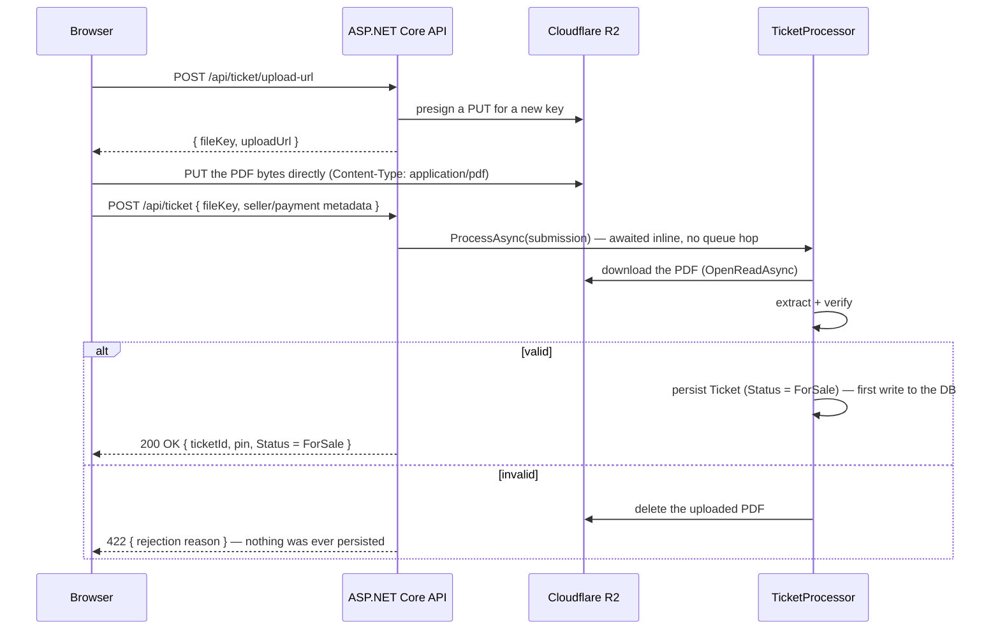

# Cloudflare R2 storage

How `manassa-ticket-backend` stores ticket PDFs using Cloudflare R2.

## Why it's here

Every posted ticket listing has a PDF attached, and that PDF needs to live somewhere durable:

- so it can be re-downloaded and attached to the buyer's confirmation email after a sale
  (`SmtpEmailSender`), and
- so a listing survives an app restart or redeploy.

R2 is an S3-compatible object store, so the app talks to it with the standard `AWSSDK.S3`
client pointed at Cloudflare's S3-compatible endpoint instead of AWS. There is no local-disk
storage anywhere in the app — `IFileStorage` (backed by `R2FileStorage`) is the only storage
abstraction.

## Upload flow: the browser talks to R2 directly

The API never sees the PDF's bytes. Instead:



The request blocks until extraction and verification finish (a few seconds) so the browser gets
the definitive outcome directly in the response, instead of an "accepted" status it would have to
poll to resolve. Nothing is written to the database for a ticket that turns out invalid.

Because the *browser* — not the API server — uploads directly to R2, **CORS must be enabled on
the bucket** (see [Setting it up in Cloudflare](#setting-it-up-in-cloudflare) below) or the
browser's `PUT` to the presigned URL will be blocked before it ever reaches R2.

## Download flow: presigned GET, also direct

A ticket's owner (the seller, via the same delete-token bearer auth used for delete/republish/
modify) can fetch a short-lived presigned download URL for their own listing's PDF:

`GET /api/ticket/file-url` (Bearer: delete token) → `{ downloadUrl }` → browser downloads
straight from R2.

This is separate from `SmtpEmailSender`, which still reads the PDF server-side (via
`IFileStorage.OpenReadAsync`) to attach it to the buyer's purchase-confirmation email — that
never touches the browser, so it needs no presigned URL or CORS.

## Configuration

`R2Options` binds from the `"Storage:R2"` section:

```json
"Storage": {
  "PermanentUploadPath": "tickets"
}
```

```csharp
// Configuration/R2Options.cs
public class R2Options
{
    public string AccountId { get; set; } = string.Empty;
    public string AccessKeyId { get; set; } = string.Empty;
    public string SecretAccessKey { get; set; } = string.Empty;
    public string BucketName { get; set; } = string.Empty;
}
```

`PermanentUploadPath` (in `appsettings.json`, non-secret) is just the R2 object-key prefix
ticket PDFs are saved under — R2 has no real folders, it's purely a naming convention for the
key (`{PermanentUploadPath}/{Guid}.pdf`). `PostTicketRequestValidator` also uses it to reject any
`FileKey` that isn't one the API itself issued via `/api/ticket/upload-url`.

The four `R2Options` fields are all secrets, so — consistent with `Stripe__*`, `RabbitMq__*`,
etc. — they come from `.env`, not `appsettings.json`:

```
Storage__R2__AccountId=...
Storage__R2__AccessKeyId=...
Storage__R2__SecretAccessKey=...
Storage__R2__BucketName=...
```

`Program.cs` builds the S3 client from these directly against Cloudflare's endpoint:

```csharp
builder.Services.AddSingleton<IAmazonS3>(sp =>
{
    var r2 = sp.GetRequiredService<IOptions<R2Options>>().Value;
    var config = new AmazonS3Config
    {
        ServiceURL = $"https://{r2.AccountId}.r2.cloudflarestorage.com",
        ForcePathStyle = true
    };

    return new AmazonS3Client(r2.AccessKeyId, r2.SecretAccessKey, config);
});
```

`ForcePathStyle = true` is required — R2 doesn't support virtual-hosted-style bucket addressing
the way AWS S3 does.

## One bucket per environment

Use two separate R2 buckets — e.g. `manassa-tickets-dev` and `manassa-tickets-prod` — so dev testing
can never touch, overwrite, or leak production ticket PDFs. Nothing in the code needs to change
between environments: only `Storage__R2__BucketName` (and usually the credentials, if you scope
an API token per bucket — see below) differs between your dev `.env` and your production `.env`,
the same way `ConnectionStrings__Postgres` or `RabbitMq__Url` do.

## Setting it up in Cloudflare

1. **Create the buckets.** Cloudflare dashboard → R2 → Create bucket. Create one for dev
   (e.g. `manassa-tickets-dev`) and one for production (e.g. `manassa-tickets-prod`). Any region/
   location hint is fine — pick the one closest to where the app runs.
2. **Get your Account ID.** It's shown on the R2 overview page (also on the main dashboard's
   right sidebar) — this is the `xxxxxxxx` in `xxxxxxxx.r2.cloudflarestorage.com`, used for
   `Storage__R2__AccountId`.
3. **Create an API token.** R2 → Manage API tokens → Create API token.
   - Give it **Object Read & Write** permission.
   - Scope it to the specific bucket (dev or prod) rather than "Apply to all buckets" — this
     way a leaked dev credential can't touch production data. This means you'll create **two**
     tokens, one per bucket/environment.
   - Cloudflare shows the **Access Key ID** and **Secret Access Key** once, at creation time —
     copy both immediately into the corresponding `.env` (`Storage__R2__AccessKeyId` /
     `Storage__R2__SecretAccessKey`). They can't be viewed again afterward; if lost, revoke the
     token and create a new one.
4. **Set a CORS policy on each bucket.** Required — the browser PUTs (and downloads) directly
   against R2, not through the API. Bucket → Settings → CORS Policy → add a rule allowing your
   frontend's origin(s) (e.g. `http://localhost:5173` for dev, your real domain for prod),
   methods `PUT` and `GET`, and allowed header `content-type` (the presigned upload URL is
   signed with a fixed `Content-Type: application/pdf`, so the browser's `PUT` must send that
   exact header). Do this for both the dev and prod buckets.
5. **Fill in `.env`.** See `.env.example` for the four `Storage__R2__*` keys and where each
   value comes from.

## Running it locally

`docker compose up --build` (or `scripts\dev.ps1`) picks up `Storage__R2__*` from `.env` like
every other secret — see the root `README.md`'s Deployment section. There's no local R2
emulator in this stack; local development talks to your real `manassa-tickets-dev` bucket, so the
CORS rule for `http://localhost:5173` (or wherever the frontend dev server runs) must already be
in place on that bucket.

If `Storage__R2__*` is left blank, nothing fails at startup — `AmazonS3Client` construction and
`IOptions<R2Options>` binding both succeed with empty strings. Generating a presigned URL
(`GetPreSignedURLAsync`) doesn't call R2 at all — it's a local signing operation — so
`/api/ticket/upload-url` will still return a (useless) URL; the browser's subsequent `PUT` to
that URL is what actually fails, with a `403` from R2.

## Production

Same as dev, just pointed at the `manassa-tickets-prod` bucket, its own scoped API token, and a
CORS rule for the real frontend domain instead of `localhost`. No code or compose changes are
needed to switch between environments — only `.env`, consistent with the rest of this project's
deployment story.

## File map

| File | Role |
|---|---|
| `Configuration/R2Options.cs` | bound config (`AccountId`, `AccessKeyId`, `SecretAccessKey`, `BucketName`) |
| `Configuration/StorageOptions.cs` | non-secret `PermanentUploadPath` key prefix |
| `Services/FileStorage/IFileStorage.cs` | storage abstraction: presigned upload/download URLs, `OpenReadAsync`, `DeleteAsync` |
| `Services/FileStorage/R2FileStorage.cs` | `IFileStorage` implementation backed by `IAmazonS3` |
| `Program.cs` | builds the `IAmazonS3` singleton against R2's endpoint |
| `Services/Tickets/TicketPoster.cs` | issues the upload URL; calls `TicketProcessor` directly and awaits the result |
| `Services/Tickets/TicketProcessor.cs` | downloads from R2, extracts/verifies, persists on success or rejects (deleting the R2 file) with nothing written to the DB |
| `Services/Tickets/TicketDeleter.cs` | issues the owner-only presigned download URL (`GetFileUrlByTokenAsync`) |
| `Services/Email/SmtpEmailSender.cs` | reads a stored PDF back out server-side to attach to an email |
